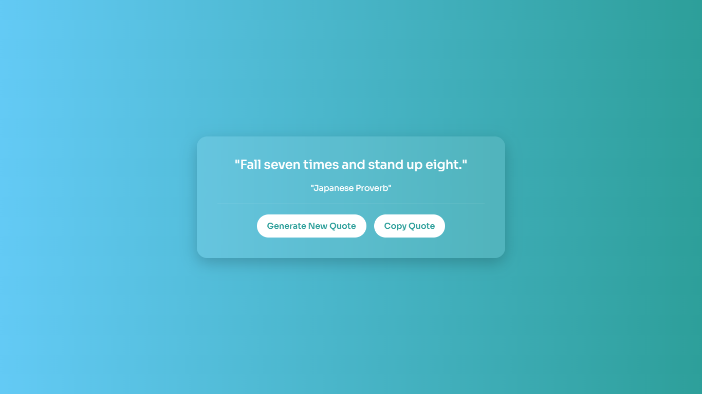

# 🌟 Random Quote Generator

A simple, beautiful web app that fetches and displays a new random quote with each click. Built using **HTML**, **CSS**, and **JavaScript** — and powered by a quote API.

<br/>

 

---

## 🚀 Features

- ✨ Fetches fresh random quotes from an external API
- 📋 Copy any quote to clipboard with one click
- 🎨 Beautiful linear gradient background
- 📱 Responsive & mobile-friendly design
- 🎬 Smooth fade-in animations for quotes

---

## 🛠️ Tech Stack

- **HTML5**
- **CSS3**
- **JavaScript**
- **Quotes API** (from [quotes-api-self.vercel.app](https://quotes-api-self.vercel.app))

---

## 📦 How to Run the Project

1. **Clone the repository** or [Download ZIP](#)  
   ```bash
   git clone https://github.com/C-W-Praduman/RandomQuate-generate.git

   📁 Random-Quote-Generator/
├── index.html       # Main HTML structure
├── style.css        # CSS styling
├── script.js        # JavaScript logic 
└── README.md        # Project documentation

